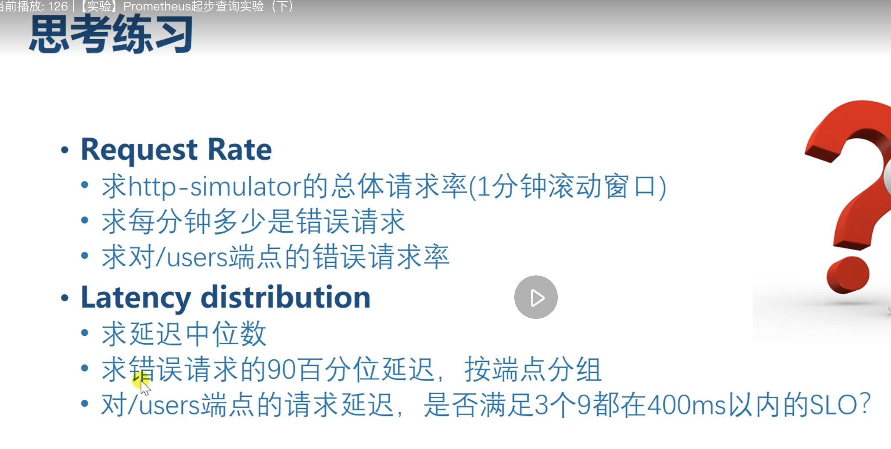

求 http simulator 的总体请求率 (1分钟滚动窗口)

```
sum(rate(http_requests_total{job="http-simulator"}[1m]))
```

求 每分钟多少是错误请求

```
http_requests_total{job="http-simulator",status="500"} - http_requests_total{job="http-simulator",status="500"} offset 1m
```

求对 /users 端点的错误请求率
```
rate(http_requests_total{job="http-simulator",endpoint="/users",status="500"}[1m])
```

Latency distribution

求 延迟中位数
```
histogram_quantile(0.5, http_request_duration_milliseconds_bucket)
```

求 错误请求的 90 百分位延迟，按端点分组
```
  sort_desc(
    histogram_quantile(0.9, sum by (endpoint, le) (http_request_duration_milliseconds_bucket{status="500"}) )
  )
  ```

对 /users 端点的请求延迟 ，是否满足3个9都在400ms以内的 SLO
  ```
  histogram_quantile(0.999, sum by (le) (http_request_duration_milliseconds_bucket{endpoint="/users"}))
  ```
