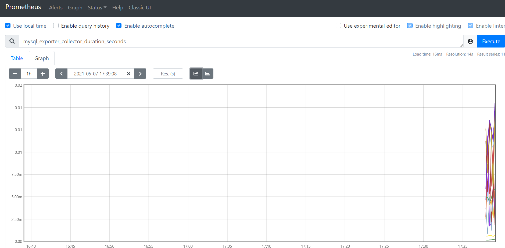

# 安装mysqld_exporter并实现mysql服务监控

-   下载mysqld_exporter-0.13.0-rc.0.linux-amd64.tar.gz软件

    -   https://github.com/prometheus/mysqld_exporter/releases/download/v0.13.0-rc.0/mysqld_exporter-0.13.0-rc.0.linux-amd64.tar.gz

-   上次、解压、重命名

    ```shell
    tar zxvf mysqld_exporter-0.13.0-rc.0.linux-amd64.tar.gz -C /opt/prometheus-2.26/
    mv /opt/prometheus-2.26/mysqld_exporter-0.13.0-rc.0.linux-amd64/ /opt/prometheus-2.26/mysqld_exporter/
    ```

-   使用mysql_exporter用户，进入mysql客户端进行授权

    ```sql
    SHOW VARIABLES LIKE 'validate_password%';
    set global validate_password_policy=LOW; 
    set global validate_password_length=6;
    # 授权
    GRANT PROCESS, REPLICATION CLIENT, SELECT ON *.* TO 'mysql_exporter'@'localhost' IDENTIFIED BY '123456' WITH MAX_USER_CONNECTIONS 3;
    flush privileges;
    ```

-   注册系统服务

    ```shell
    # 创建并编辑文件
    vim /etc/systemd/system/mysqld_exporter.service
    # 文件内容
    [Unit]
    Description=mysqld_exporter
    Documentation=Prometheus mysql exporter plugin
    
    [Service]
    Type=simple
    User=mysql
    Environment=DATA_SOURCE_NAME=mysql_exporter:123456@(localhost:3306)/
    ExecStart=/opt/prometheus-2.26/mysqld_exporter/mysqld_exporter --config.my-cnf /etc/my.cnf \
      --collect.slave_status \
      --collect.slave_hosts \
      --log.level=error \
      --collect.info_schema.processlist \
      --collect.info_schema.innodb_metrics \
      --collect.info_schema.innodb_tablespaces \
      --collect.info_schema.innodb_cmp \
      --collect.info_schema.innodb_cmpmem 
    Restart=on-failure
    [Install]
    WantedBy=multi-user.target
    ```

-   启动mysqld_exporter服务

    ```shell
    # 设置开机自启动
    systemctl enable mysqld_exporter
    # 启动服务
    systemctl start mysqld_exporter
    # 查看服务状态
    systemctl status mysqld_exporter
    ```

-   访问页面mysqld_exporter服务

    -   http://node1:9104/

        

-   修改prometheus配置文件

    ```yaml
    # vim prometheus.yml
    #scrape_configs:
      - job_name: 'mysql'
        scrape_interval: 1s
        static_configs:
        - targets: ['localhost:9104']
          labels:
            instance: 'mysqld_exporter'
    ```

-   重启prometheus服务，查看web页面的mysql服务

    `systemctl restart prometheus.service`

-   prometheus图表查看

    

    