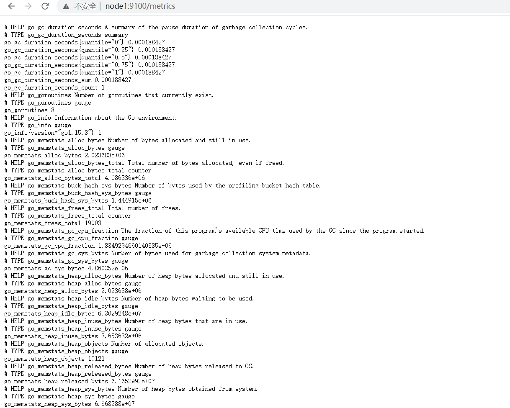
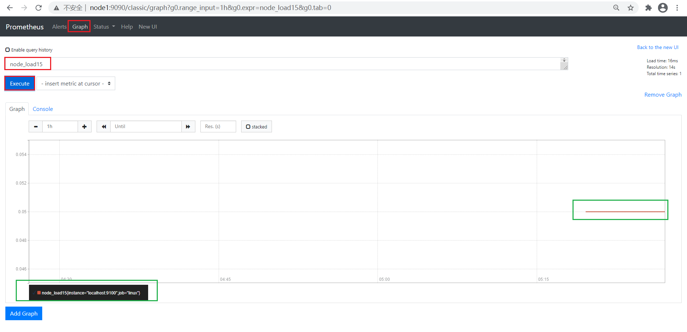

# node_export插件实现linux服务监控

- 下载node_exporter插件

    - 直接下载：
        - https://github.com/prometheus/node_exporter/releases/download/v1.1.2/node_exporter-1.1.2.linux-amd64.tar.gz

- 上传并解压压缩包，重命名

    ```shell
    tar zxvf node_exporter-1.1.2.linux-amd64.tar.gz -C /opt/prometheus-2.26
    mv /opt/prometheus-2.26/node_exporter-1.1.2.linux-amd64 /opt/prometheus-2.26/node_exporter
    ```

- 注册系统服务

    ```shell
    # 创建并编辑文件
    vim /etc/systemd/system/node_exporter.service
    # 文件内容
    [Unit]
    Description=node_exporter
    Documentation=Prometheus node_exporter plugin
    
    [Service]
    ExecStart=/opt/prometheus-2.26/node_exporter/node_exporter
    Restart=on-failure
    [Install]
    WantedBy=multi-user.target
    ```

- 启动node_exporter服务

    ```shell
    # 设置开机自启动
    systemctl enable node_exporter
    # 启动服务
    systemctl start node_exporter
    # 查看服务状态
    systemctl status node_exporter
    ```

- 访问验证

    - http://node1:9100/metrics

        [](http://node1:9100/metrics)

- 给prometheus添加监控linux服务配置

    - prometheus.yml

    ```yml
    scrape_configs:
    
      - job_name: 'prometheus'
        static_configs:
          - targets: ['localhost:9090']
    
      # 新添加
      - job_name: 'linux'
        static_configs:
          - targets: ['localhost:9100']
            labels:
              instance: node1
    ```

    - 重启prometheus服务

        `systemctl restart prometheus.service`

    - prometheus服务验证

        -  Status->Targets

        .png)

    -  使用Prometheus Web来验证Node Exporter的数据已经被正确的采集 

        1. 查看当前主机的CPU使用情况：node_cpu_seconds_total

            - graph搜索栏：node_cpu_seconds_total

                

        2. 查看当前主机的CPU负载情况 

            - node_load15

                