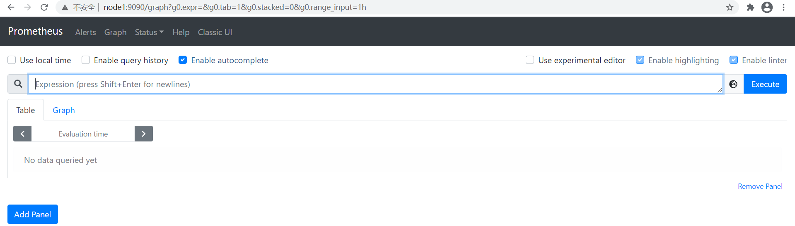

# prometheus安装

- 下载prometheus(prometheus-2.26.0.linux-amd64.tar.gz)

    - 上传prometheus-2.26.0.linux-amd64.tar.gz，并解压

    ```shell
    # 解压安装包
    tar zxvf prometheus-2.26.0.linux-amd64.tar.gz -C /opt
    # 修改文件名
    mv /opt/prometheus-2.26.0.linux-amd64/ /opt/prometheus-2.26
    # 进入解压后的安装包
    cd /opt/prometheus-2.26
    ```

- 验证安装

    `./prometheus --version`

    ```reStructuredText
    [root@node1 /opt/prometheus-2.26]$ ./prometheus --version
    prometheus, version 2.26.0 (branch: HEAD, revision: 3cafc58827d1ebd1a67749f88be4218f0bab3d8d)
      build user:       root@a67cafebe6d0
      build date:       20210331-11:56:23
      go version:       go1.16.2
      platform:         linux/amd64
    ```

- prometheus配置

    - prometheus.yml([root@node1 /opt/prometheus-2.26]$ **cat prometheus.yml**)

        ```yaml
        # 全局配置
        # my global config
        global:
          scrape_interval:     15s # Set the scrape interval to every 15 seconds. Default is every 1 minute. 默认抓取间隔, 15秒向目标抓取一次数据
          evaluation_interval: 15s # Evaluate rules every 15 seconds. The default is every 1 minute. 每15秒按抓取规则抓取一次数据，默认每1分钟执行一次
          # scrape_timeout is set to the global default (10s).
        
        # Alertmanager configuration 告警信息
        alerting:
          alertmanagers:
          - static_configs:
            - targets:
              # - alertmanager:9093
        
        # Load rules once and periodically evaluate them according to the global 'evaluation_interval'. 定期执行抓取配置规则
        rule_files:
          # - "first_rules.yml"
          # - "second_rules.yml"
        
        # A scrape configuration containing exactly one endpoint to scrape: 抓取对象配置
        # Here it's Prometheus itself. 抓取prometheus本身的配置
        scrape_configs:
          # The job name is added as a label `job=<job_name>` to any timeseries scraped from this config.
          - job_name: 'prometheus'
        
            # metrics_path defaults to '/metrics' 抓取默认路径：指标s
            # scheme defaults to 'http'.
        
            static_configs:
            - targets: ['localhost:9090']
        ```

    

- 注册系统服务

    ```shell
    # 创建并编辑文件
    vim /etc/systemd/system/prometheus.service
    # 文件内容
    [Unit]
    Description=Prometheus
    Documentation=Prometheus Monitoring System
    
    [Service]
    ExecStart=/opt/prometheus-2.26/prometheus --config.file=/opt/prometheus-2.26/prometheus.yml
    Restart=on-failure
    [Install]
    WantedBy=multi-user.target
    ```

- 启动prometheus服务

    ```shell
    # 设置开机自启动
    systemctl enable prometheus
    # 启动服务
    systemctl start prometheus
    # 查看服务状态
    systemctl status prometheus
    ```

- 访问服务

    - http://node1:9090

        
