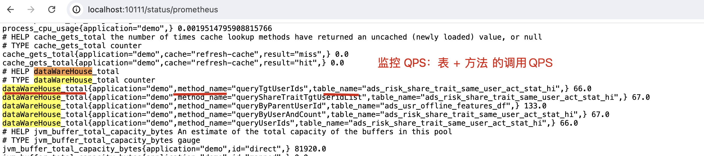
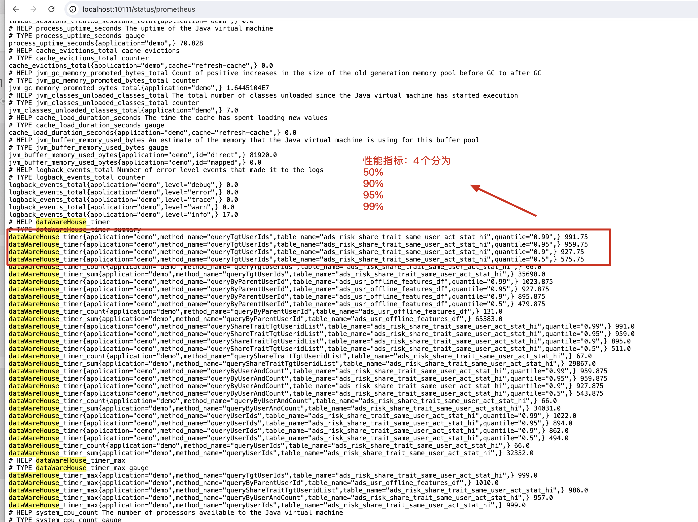
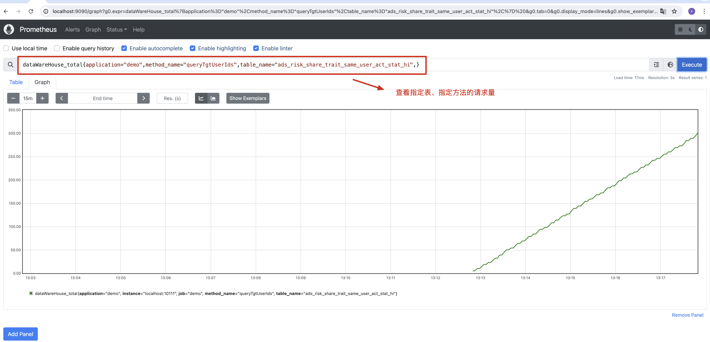
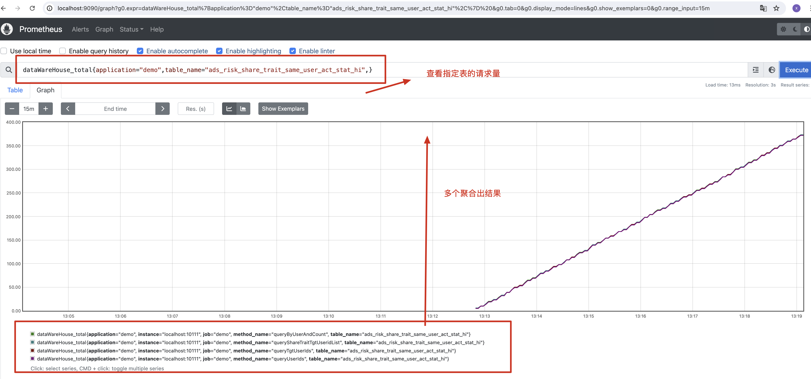
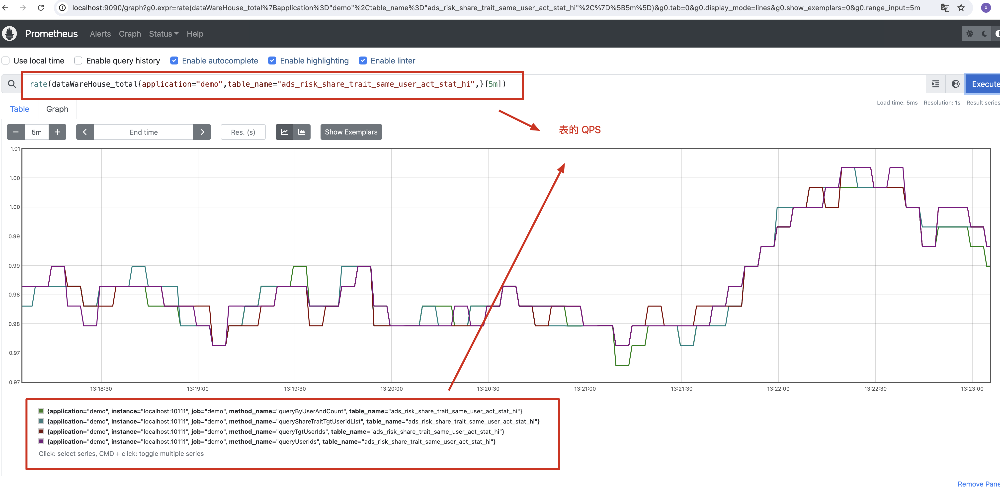
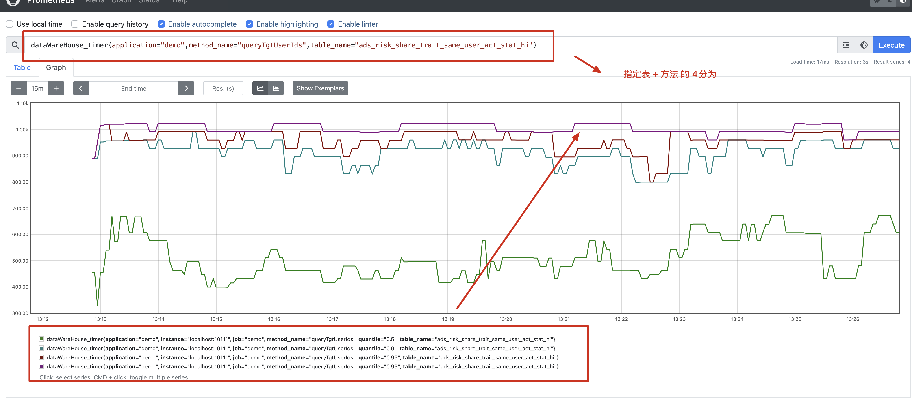
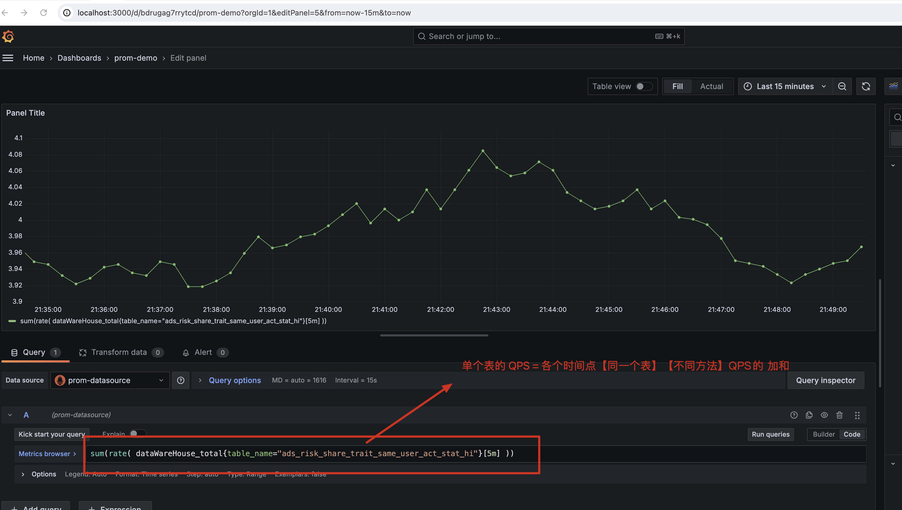
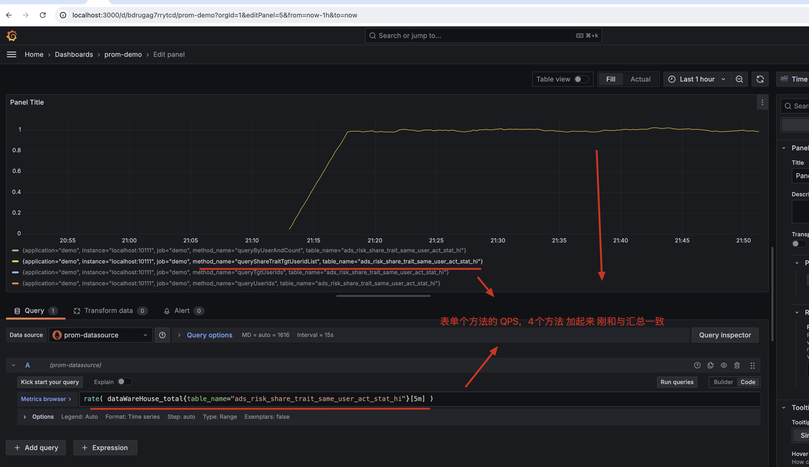
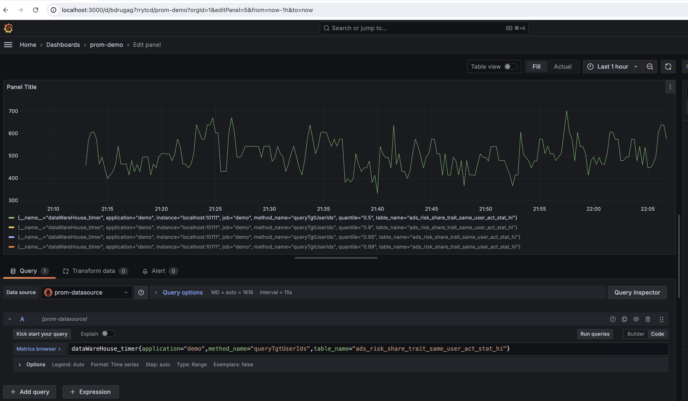

打开 http://localhost:10111/status/prometheus

搜索 dataWareHouse

```

```



```
# HELP dataWareHouse_total  
# TYPE dataWareHouse_total counter
dataWareHouse_total{application="demo",method_name="queryTgtUserIds",table_name="ads_risk_share_trait_same_user_act_stat_hi",} 66.0
dataWareHouse_total{application="demo",method_name="queryShareTraitTgtUseridList",table_name="ads_risk_share_trait_same_user_act_stat_hi",} 67.0
dataWareHouse_total{application="demo",method_name="queryByParentUserId",table_name="ads_usr_offline_features_df",} 133.0
dataWareHouse_total{application="demo",method_name="queryByUserAndCount",table_name="ads_risk_share_trait_same_user_act_stat_hi",} 67.0
dataWareHouse_total{application="demo",method_name="queryUserIds",table_name="ads_risk_share_trait_same_user_act_stat_hi",} 66.0
```






```
dataWareHouse_total{application="demo",method_name="queryTgtUserIds",table_name="ads_risk_share_trait_same_user_act_stat_hi",}
```





```
rate(dataWareHouse_total{application="demo",table_name="ads_risk_share_trait_same_user_act_stat_hi",}[5m])
```



```
dataWareHouse_timer{application="demo",method_name="queryTgtUserIds",table_name="ads_risk_share_trait_same_user_act_stat_hi"}
```







